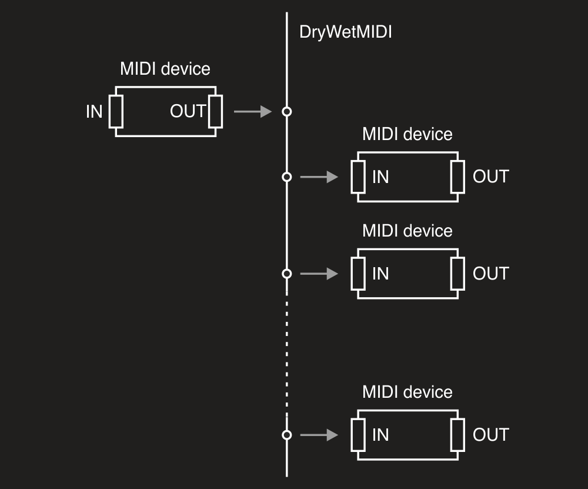

# Devices connector

You can redirect MIDI events from [input device](Input-device.md) to [output device(s)](Output-device.md) using [DevicesConnector](xref:Melanchall.DryWetMidi.Devices.DevicesConnector) class. To understand what input and output MIDI device is in DryWetMIDI, please read [Overview](Overview.md) article.

Device connector connects an instance of the [IInputDevice](xref:Melanchall.DryWetMidi.Devices.IInputDevice) to one or multiple instances of the [IOutputDevice](xref:Melanchall.DryWetMidi.Devices.IOutputDevice). To get an instance of `DevicesConnector` class you can use either its constructor or `Connect` extension method on `IInputDevice`. In first case you need to call [Connect](xref:Melanchall.DryWetMidi.Devices.DevicesConnector.Connect) method after you get `DevicesConnector` instance. In second case the method will be called automatically.

Also you can call [Disconnect](xref:Melanchall.DryWetMidi.Devices.DevicesConnector.Disconnect) at any time to disable connection between devices.

The image below shows how devices will be connected in DryWetMIDI:



Following small example shows basic usage of `DevicesConnector`:

```csharp
using Melanchall.DryWetMidi.Devices;

// ...

using (var inputDevice = InputDevice.GetByName("MIDI In"))
using (var outputDevice1 = OutputDevice.GetByName("MIDI Out 1"))
using (var outputDevice2 = OutputDevice.GetByName("MIDI Out 2"))
using (var devicesConnector = new DevicesConnector(inputDevice, outputDevice1, outputDevice2))
{
    devicesConnector.Connect();
}
```

So if a MIDI event will be received by _MIDI In_ device, the event will be sent to both _MIDI Out 1_ and _MIDI Out 2_.

Don't forget to call [StartEventsListening](xref:Melanchall.DryWetMidi.Devices.IInputDevice.StartEventsListening) on input device to make sure [EventReceived](xref:Melanchall.DryWetMidi.Devices.IInputDevice.EventReceived) will be fired and MIDI event redirected to output devices. Read more in [Input device](Input-device.md) article.