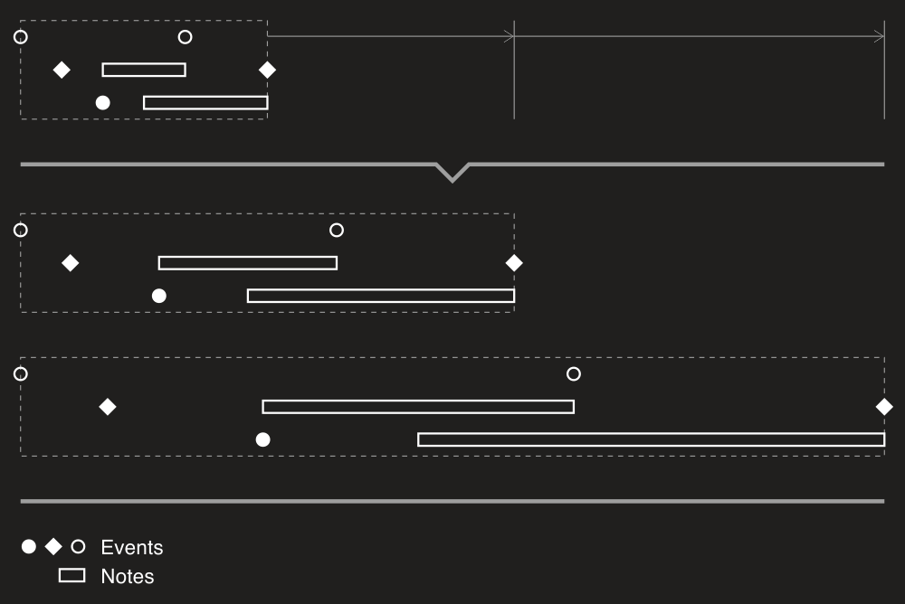
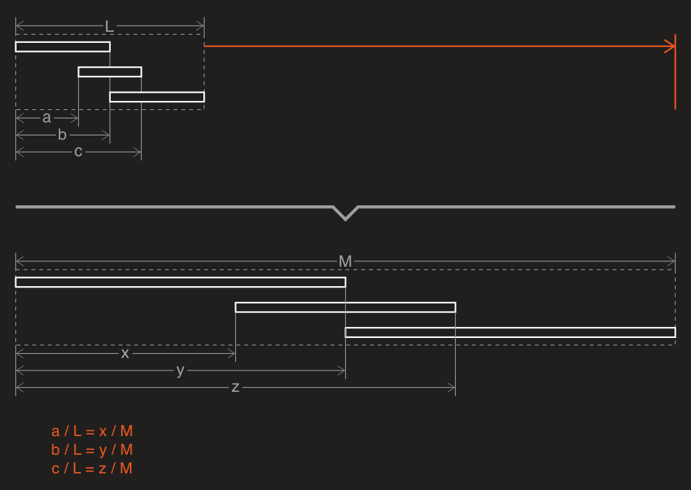

---
uid: a_resizer
---

# Resizer

DryWetMIDI provides the tool to resize a group of objects or an entire MIDI file – [Resizer](xref:Melanchall.DryWetMidi.Tools.Resizer). Quick example of resizing in action:

So as you can see the tool treats all passed objects as a single group and then sizes this group to the new length saving all time-to-length ratios. For example, if an event was at the middle of objects group, it will be at the middle of the group too after resizing. Following image explains this visually for the group of three notes:

You use [ResizeObjectsGroup](xref:Melanchall.DryWetMidi.Tools.Resizer.ResizeObjectsGroup*) methods to stretch or shrink a group of [timed objects](xref:Melanchall.DryWetMidi.Interaction.ITimedObject). You can size a group either to the specified new length or by ratio. Ratio means that all distances from the start of a group will be multiplied by this value. So if ratio of `2` is specified, an objects group will be enlarged by 2 times. And `0.5` means the group will be shrinked by 2 times (new length will be half (`0.5`) of the original one).

There also [Resize](xref:Melanchall.DryWetMidi.Tools.Resizer.Resize*) methods to resize [MidiFile](xref:Melanchall.DryWetMidi.Core.MidiFile) or [TrackChunk](xref:Melanchall.DryWetMidi.Core.TrackChunk).

If you're resizing a group or file to the specified length, please take care of the distance calculation type which can be set via [ObjectsGroupResizingSettings.DistanceCalculationType](xref:Melanchall.DryWetMidi.Tools.ObjectsGroupResizingSettings.DistanceCalculationType) property of the settings that you can pass to the tool's methods. For example, if you specify new length as a [metric](xref:a_time_length#metric) one – `10` seconds – it worth to set `DistanceCalculationType` to the [TimeSpanType.Metric](xref:Melanchall.DryWetMidi.Interaction.TimeSpanType.Metric) value.